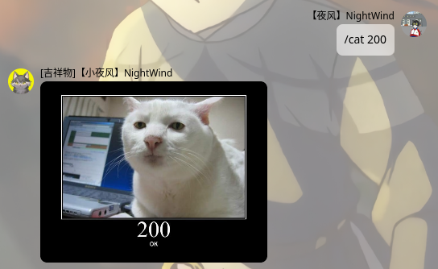
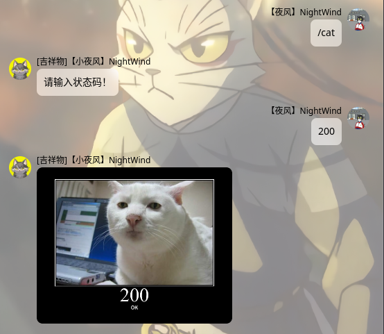

  
   
  

# nonebot-plugin-simple-httpcat

_✨ 适用于nonebot2 v11、简单粗暴的httpcat插件 调用https://http.cat的图片✨_

## 📖 介绍

简单粗暴的httpcat插件，参考了<a href="https://github.com/zjkwdy/nonebot_plugin_weather_lite">zjkwdy大佬的weather_lite插件</a>,调用了https://http.cat中的图片( 

## 💿 安装

使用 nb-cli 安装

在 nonebot2 项目的根目录下打开命令行, 输入以下指令安装

    nb plugin install nonebot-plugin-simple-httpcat

pip安装

    pip install nonebot-plugin-simple-httpcat

打开 nonebot2 项目根目录下的 `pyproject.toml` 文件, 在 `[tool.nonebot]` 部分追加写入

    plugins = ["nonebot_plugin_simple_httpcat"]

Github下载

手动克隆本仓库或直接下载压缩包，将里面的nonebot_plugin_simple_httpcat文件夹复制到src/plugins中

## 🎉 使用
### 指令表(请加上指令前缀，在没有更改的情况下，默认为"/")
| 指令 | 权限 | 需要@ | 范围 | 说明 |
|:-----:|:----:|:----:|:----:|:----:|
| cat | 群员 | 否 | 群聊 | 需要在后面加上状态码|
### 示例

/cat 状态码

单纯的/cat 